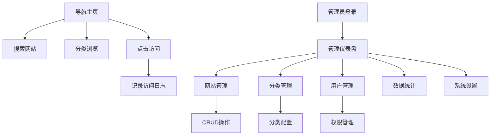

## 1. Product Overview
咕噜水导航网站是一个简洁实用的网址导航平台，旨在为用户提供快速访问常用网站的入口。该网站包含用户友好的导航界面和完整的后台管理系统，支持网站分类管理、用户权限控制、访问统计等功能。

目标用户包括需要整理和分享常用网站资源的个人用户、团队和企业。通过分类管理和搜索功能，帮助用户高效管理和发现优质网站资源。

## 2. Core Features

### 2.1 User Roles
| Role | Registration Method | Core Permissions |
|------|---------------------|------------------|
| Visitor | No registration required | 浏览导航网站、搜索网站、访问链接 |
| Admin | 后台创建或默认管理员账户 | 管理网站、分类、用户、系统设置，查看统计数据 |

### 2.2 Feature Module
导航网站项目包含以下主要功能模块：

1. **导航主页**：网站分类展示、搜索功能、网站链接访问
2. **管理后台**：仪表盘、网站管理、分类管理、用户管理、数据统计、系统设置
3. **用户认证**：管理员登录、权限验证、会话管理

### 2.3 Page Details
| Page Name | Module Name | Feature description |
|-----------|-------------|---------------------|
| Navigation Homepage | Header Section | 显示网站标题、副标题、后台管理入口按钮 |
| Navigation Homepage | Search Function | 实时搜索网站名称、描述、URL，支持模糊匹配 |
| Navigation Homepage | Category Display | 按分类展示网站列表，显示分类图标和名称 |
| Navigation Homepage | Site Cards | 显示网站名称、描述、图标，点击跳转至目标网站 |
| Navigation Homepage | Loading States | 数据加载中显示加载动画，错误时显示重试按钮 |
| Admin Dashboard | Login Page | 管理员用户名密码登录，表单验证，登录状态保持 |
| Admin Dashboard | Dashboard | 显示系统概览、网站总数、分类数量、用户数量等统计信息 |
| Admin Dashboard | Site Management | 网站的增删改查、批量操作、搜索过滤、分页显示 |
| Admin Dashboard | Category Management | 分类的增删改查、图标设置、排序调整、状态管理 |
| Admin Dashboard | User Management | 用户账户管理、角色权限设置、状态控制 |
| Admin Dashboard | Statistics | 网站访问统计、点击排行、访问趋势图表 |
| Admin Dashboard | System Settings | 网站基本信息设置、功能开关、系统参数配置 |
| Admin Dashboard | Profile | 管理员个人资料修改、密码更新 |

## 3. Core Process

### 访客使用流程
1. 访客访问导航主页，系统自动加载网站分类数据
2. 访客可以通过搜索框快速查找目标网站
3. 点击网站卡片直接跳转至目标网站
4. 系统记录访问日志用于统计分析

### 管理员操作流程
1. 管理员通过登录页面进入后台管理系统
2. 在仪表盘查看系统整体运行状态和统计数据
3. 管理网站：添加新网站、编辑现有网站信息、删除无效网站
4. 管理分类：创建分类、设置分类图标、调整分类排序
5. 管理用户：创建用户、分配权限、控制账户状态
6. 查看统计：分析网站访问数据、导出统计报表
7. 系统设置：配置网站标题、描述、功能开关等参数

## 4. User Interface Design

### 4.1 Design Style
- **主色调**：蓝色系（#1890ff）为主色调，白色背景
- **按钮样式**：圆角矩形设计，悬停效果，主要操作使用主色调
- **字体**：系统默认字体，标题使用较大字号（18-24px），正文使用标准字号（14-16px）
- **布局风格**：卡片式布局，分类分区展示，响应式网格系统
- **图标风格**：使用emoji图标和Element Plus图标库，简洁直观
- **动画效果**：页面加载动画、按钮悬停效果、平滑过渡

### 4.2 Page Design Overview
| Page Name | Module Name | UI Elements |
|-----------|-------------|-------------|
| Navigation Homepage | Header | 居中标题，左侧导航图标，右侧后台管理按钮，渐变背景 |
| Navigation Homepage | Search Bar | 圆角输入框，占位符文本，搜索图标，宽度自适应 |
| Navigation Homepage | Category Cards | 卡片阴影效果，分类图标+标题，下方显示网站数量 |
| Navigation Homepage | Site Items | 网格布局，网站图标/名称/描述，悬停高亮效果 |
| Admin Dashboard | Sidebar | 左侧导航菜单，图标+文字，选中高亮，折叠功能 |
| Admin Dashboard | Data Tables | 表格展示数据，操作按钮组，分页控件，搜索过滤 |
| Admin Dashboard | Forms | 标签+输入框组合，必填验证提示，提交按钮 |
| Admin Dashboard | Charts | ECharts图表展示，支持柱状图/饼图/折线图 |

### 4.3 Responsiveness
- **桌面优先**：主要针对桌面端用户优化，支持1920x1080及以上分辨率
- **移动端适配**：支持平板和手机访问，采用响应式布局
- **触摸优化**：按钮和链接具有足够的点击区域，支持触摸操作
- **断点设计**：768px（平板）、480px（手机）两个主要断点