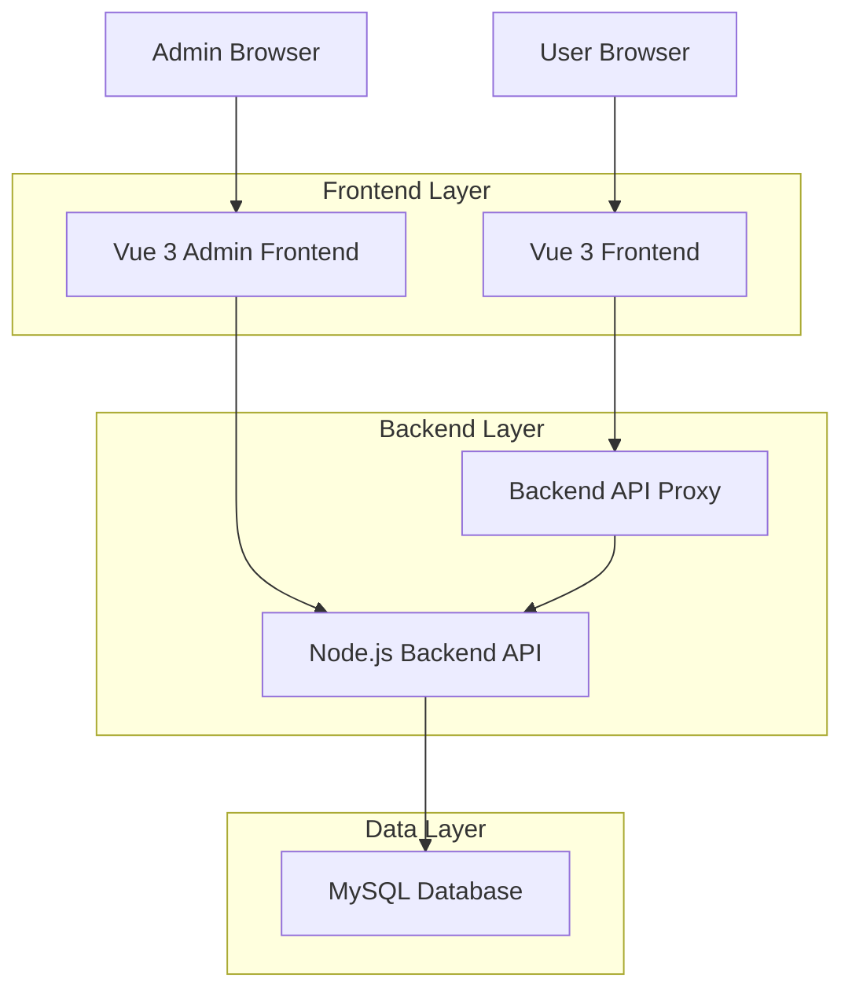
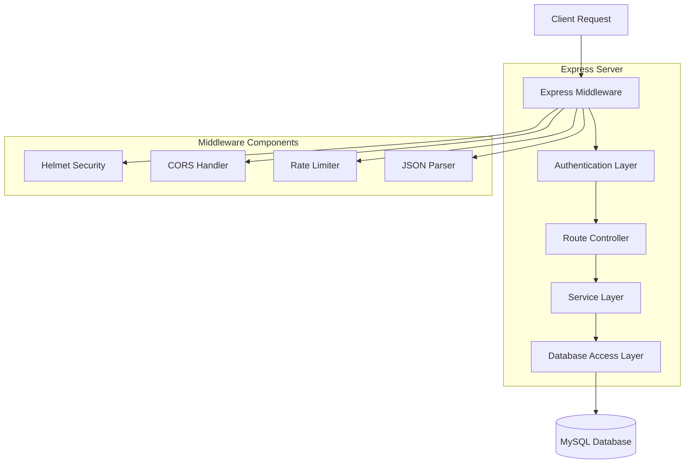
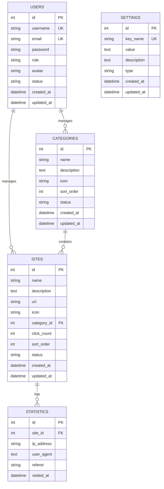

## 1. Architecture Design



## 2. Technology Description

### Frontend Technologies
- **导航主页**: Vue 3 + Vite + 原生CSS
- **管理后台**: Vue 3 + TypeScript + Element Plus + Pinia + Vue Router

### Backend Technologies
- **服务器**: Node.js + Express.js
- **数据库**: MySQL 8.0
- **认证**: JWT (JSON Web Token)
- **安全**: Helmet, CORS, Rate Limiting
- **工具库**: bcrypt (密码加密), multer (文件上传)

### Development Tools
- **构建工具**: Vite
- **包管理**: npm
- **代码规范**: Prettier
- **测试框架**: Vitest (管理前端)

## 3. Route Definitions

### 导航主页路由 (Vue 3)
| Route | Purpose |
|-------|---------|
| / | 导航主页，显示网站分类和搜索功能 |

### 管理后台路由 (Vue 3 + Vue Router)
| Route | Purpose |
|-------|---------|
| /login | 管理员登录页面 |
| /dashboard | 管理仪表盘，显示系统概览 |
| /sites | 网站管理页面 |
| /categories | 分类管理页面 |
| /users | 用户管理页面 |
| /statistics | 数据统计页面 |
| /profile | 个人资料页面 |
| /settings | 系统设置页面 |

### 后端API路由 (Express.js)
| Route | Purpose |
|-------|---------|
| /api/auth/login | 用户登录认证 |
| /api/auth/profile | 获取用户信息 |
| /api/sites | 网站CRUD操作 |
| /api/categories | 分类CRUD操作 |
| /api/users | 用户管理操作 |
| /api/statistics | 访问统计数据 |
| /api/settings | 系统设置管理 |

## 4. API Definitions

### 4.1 Authentication API

**用户登录**
```
POST /api/auth/login
```

Request:
| Param Name | Param Type | isRequired | Description |
|------------|------------|-------------|-------------|
| username | string | true | 用户名 |
| password | string | true | 密码 |

Response:
| Param Name | Param Type | Description |
|------------|-------------|-------------|
| token | string | JWT访问令牌 |
| user | object | 用户信息对象 |
| message | string | 登录状态消息 |

Example:
```json
{
  "username": "admin",
  "password": "password123"
}
```

### 4.2 Sites Management API

**获取网站列表**
```
GET /api/sites
```

Query Parameters:
| Param Name | Param Type | isRequired | Description |
|------------|------------|-------------|-------------|
| page | number | false | 页码，默认1 |
| limit | number | false | 每页数量，默认10 |
| search | string | false | 搜索关键词 |
| category_id | number | false | 分类ID筛选 |

**创建新网站**
```
POST /api/sites
```

Request:
| Param Name | Param Type | isRequired | Description |
|------------|------------|-------------|-------------|
| name | string | true | 网站名称 |
| description | string | false | 网站描述 |
| url | string | true | 网站URL |
| category_id | number | true | 分类ID |
| sort_order | number | false | 排序值 |

### 4.3 Categories Management API

**获取分类列表**
```
GET /api/categories
```

**创建分类**
```
POST /api/categories
```

Request:
| Param Name | Param Type | isRequired | Description |
|------------|------------|-------------|-------------|
| name | string | true | 分类名称 |
| description | string | false | 分类描述 |
| icon | string | false | 分类图标 |
| sort_order | number | false | 排序值 |

### 4.4 Statistics API

**获取访问统计**
```
GET /api/statistics
```

Query Parameters:
| Param Name | Param Type | isRequired | Description |
|------------|------------|-------------|-------------|
| start_date | string | false | 开始日期 |
| end_date | string | false | 结束日期 |
| site_id | number | false | 网站ID |

## 5. Server Architecture Diagram



## 6. Data Model

### 6.1 Database Schema Design



### 6.2 Data Definition Language

**用户表 (users)**
```sql
CREATE TABLE users (
    id INT PRIMARY KEY AUTO_INCREMENT,
    username VARCHAR(50) UNIQUE NOT NULL,
    email VARCHAR(100) UNIQUE NOT NULL,
    password VARCHAR(255) NOT NULL,
    role ENUM('admin', 'user') DEFAULT 'user',
    avatar VARCHAR(255) DEFAULT NULL,
    status ENUM('active', 'inactive') DEFAULT 'active',
    created_at TIMESTAMP DEFAULT CURRENT_TIMESTAMP,
    updated_at TIMESTAMP DEFAULT CURRENT_TIMESTAMP ON UPDATE CURRENT_TIMESTAMP,
    INDEX idx_username (username),
    INDEX idx_email (email),
    INDEX idx_role (role)
);
```

**分类表 (categories)**
```sql
CREATE TABLE categories (
    id INT PRIMARY KEY AUTO_INCREMENT,
    name VARCHAR(100) NOT NULL,
    description TEXT,
    icon VARCHAR(50) DEFAULT 'Link',
    sort_order INT DEFAULT 0,
    status ENUM('active', 'inactive') DEFAULT 'active',
    created_at TIMESTAMP DEFAULT CURRENT_TIMESTAMP,
    updated_at TIMESTAMP DEFAULT CURRENT_TIMESTAMP ON UPDATE CURRENT_TIMESTAMP,
    INDEX idx_status (status),
    INDEX idx_sort_order (sort_order)
);
```

**网站表 (sites)**
```sql
CREATE TABLE sites (
    id INT PRIMARY KEY AUTO_INCREMENT,
    name VARCHAR(100) NOT NULL,
    description TEXT,
    url VARCHAR(500) NOT NULL,
    icon VARCHAR(255) DEFAULT NULL,
    category_id INT,
    click_count INT DEFAULT 0,
    sort_order INT DEFAULT 0,
    status ENUM('active', 'inactive') DEFAULT 'active',
    created_at TIMESTAMP DEFAULT CURRENT_TIMESTAMP,
    updated_at TIMESTAMP DEFAULT CURRENT_TIMESTAMP ON UPDATE CURRENT_TIMESTAMP,
    FOREIGN KEY (category_id) REFERENCES categories(id) ON DELETE SET NULL,
    INDEX idx_category (category_id),
    INDEX idx_status (status),
    INDEX idx_click_count (click_count),
    INDEX idx_sort_order (sort_order),
    FULLTEXT idx_search (name, description)
);
```

**访问统计表 (statistics)**
```sql
CREATE TABLE statistics (
    id INT PRIMARY KEY AUTO_INCREMENT,
    site_id INT,
    ip_address VARCHAR(45),
    user_agent TEXT,
    referer VARCHAR(500),
    visited_at TIMESTAMP DEFAULT CURRENT_TIMESTAMP,
    FOREIGN KEY (site_id) REFERENCES sites(id) ON DELETE CASCADE,
    INDEX idx_site_id (site_id),
    INDEX idx_visited_at (visited_at),
    INDEX idx_ip_address (ip_address)
);
```

**系统设置表 (settings)**
```sql
CREATE TABLE settings (
    id INT PRIMARY KEY AUTO_INCREMENT,
    key_name VARCHAR(100) UNIQUE NOT NULL,
    value TEXT,
    description TEXT,
    type ENUM('string', 'number', 'boolean', 'json') DEFAULT 'string',
    created_at TIMESTAMP DEFAULT CURRENT_TIMESTAMP,
    updated_at TIMESTAMP DEFAULT CURRENT_TIMESTAMP ON UPDATE CURRENT_TIMESTAMP,
    INDEX idx_key_name (key_name)
);
```

### 6.3 Initial Data

**默认管理员用户**
```sql
INSERT INTO users (username, email, password, role) VALUES 
('admin', 'admin@example.com', '$2a$10$92IXUNpkjO0rOQ5byMi.Ye4oKoEa3Ro9llC/.og/at2.uheWG/igi', 'admin')
ON DUPLICATE KEY UPDATE username = username;
```

**默认分类数据**
```sql
INSERT INTO categories (name, description, icon, sort_order) VALUES 
('常用工具', '日常工作中常用的在线工具', 'Setting', 1),
('开发资源', '编程开发相关的资源和工具', 'Document', 2),
('学习教育', '在线学习和教育平台', 'User', 3),
('娱乐休闲', '娱乐和休闲相关的网站', 'DataAnalysis', 4)
ON DUPLICATE KEY UPDATE name = VALUES(name);
```

**默认系统设置**
```sql
INSERT INTO settings (key_name, value, description, type) VALUES 
('site_title', '咕噜水导航', '网站标题', 'string'),
('site_description', '一个简洁实用的网址导航站', '网站描述', 'string'),
('site_keywords', '导航,网址,工具,资源', '网站关键词', 'string'),
('enable_statistics', 'true', '是否启用访问统计', 'boolean'),
('max_sites_per_category', '20', '每个分类最大网站数量', 'number')
ON DUPLICATE KEY UPDATE key_name = VALUES(key_name);
```